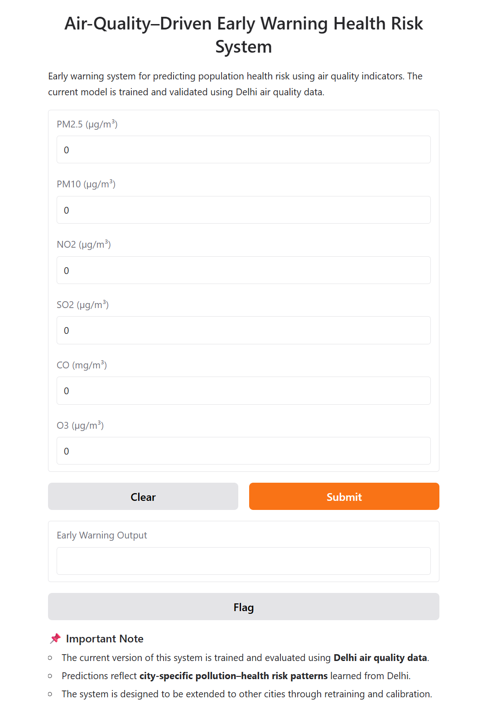

# Air Quality-Driven Early Warning Health Risk Prediction System

A machine learning–based system that predicts environmental health risk levels from air pollution exposure patterns.  
The model analyzes historical pollutant data and classifies whether a day is **High Risk** or **Normal Risk**, helping support preventive awareness.

---

## 1. Problem Statement

Most air quality systems only report the current pollution level.  
They do not indicate whether recent exposure patterns are dangerous.

This project predicts health risk from cumulative exposure, enabling people to take precautions before serious impact.

---

## 2. Objective

- Analyze historical air quality data
- Identify pollution exposure patterns
- Classify high-risk environmental days
- Provide a simple early warning interface

---

## 3. Dataset

**Dataset:** Air Quality Data in India (2015–2020)  
**City Used:** Delhi  
**Source:** Kaggle (CPCB – Government of India)  
https://www.kaggle.com/datasets/rohanrao/air-quality-data-in-india

### 3.1 Pollutants Used

- PM2.5
- PM10
- NO₂
- SO₂
- CO
- O₃

These pollutants are linked to respiratory and cardiovascular health risks.

---

## 4. Methodology

### 4.1 Data Preprocessing
- Filtered Delhi city data
- Converted Date column to datetime
- Sorted chronologically
- Handled missing values using time-based interpolation

### 4.2 Feature Engineering

To capture pollution exposure instead of single-day values:

**Lag Features**
- Previous 1, 3, and 7 day pollution levels

**Rolling Exposure**
- 3-day moving average
- 7-day moving average

### 4.3 Target Variable

A day is labeled **High Risk** if:

> PM2.5 3-day average > threshold

This reflects cumulative exposure impact.

---

## 5. Model Training

Problem formulated as **Binary Classification**

**Models trained:**
- Logistic Regression
- Random Forest
- XGBoost

Time-based train–test split used to avoid data leakage.

---

## 6. Evaluation Strategy

Focus was placed on **Recall** to avoid missing dangerous days.

**Metrics used:**
- Accuracy
- Precision
- Recall
- F1 Score
- False Negatives

**Random Forest selected as final model.**

---

## 7. Deployment

A Gradio web interface allows users to input pollutant values and receive:

- High Risk / Normal Risk prediction
- Confidence score
- Health advisory

---
## 7.1 Interface Preview




## 8. How to Run

### 8.1 Clone Repository
```bash
git clone https://github.com/your-username/air-quality-health-risk.git
cd air-quality-health-risk
```

### 8.2 Install Requirements
```bash
pip install -r requirements.txt
```

### 8.3 Run Application
```bash
python app.py
```

---

## 9. Limitations

- Trained on single city (Delhi)
- Not real-time sensor connected
- Not a medical diagnosis system
- Based on environmental exposure only

---

## 10. Future Work

- Real-time pollution API integration
- Next-day forecasting using time-series models
- Personalized alerts
- Smart city integration

---

## 11. Reference

Central Pollution Control Board (CPCB), Government of India  
Air Quality Data in India (2015–2020)  
https://www.kaggle.com/datasets/rohanrao/air-quality-data-in-india

---

## 12. Author

**Alka**
